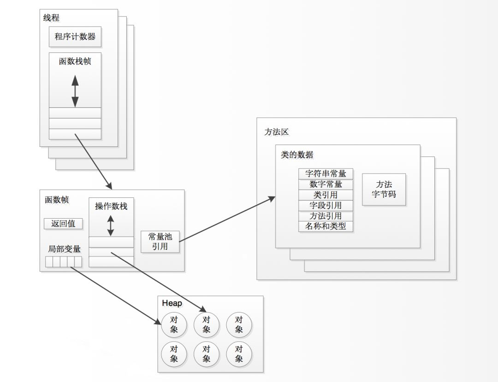

# Rust + JVM research


## Roadmap

 - [x] .class parser
 - [ ] code parser
    - [x] support hello world
 - [ ] VM
    - [ ] Runtime
    - [ ] Thread
    - [ ] Frame  
 - [ ] JIT / interp
 - [ ] GC
 - [ ] _Pass test cases in JDK_

## Document

### .class file Parser

 - Official：[Java The class File Format ](https://docs.oracle.com/javase/specs/jvms/se7/html/jvms-4.html)
 - 中文相关翻译：[JVM 揭秘：一个 class 文件的前世今生](https://zhuanlan.zhihu.com/p/33440868)

#### The ClassFile Structure

```
ClassFile {
    u4             magic;
    u2             minor_version;
    u2             major_version;
    u2             constant_pool_count;
    cp_info        constant_pool[constant_pool_count-1];
    u2             access_flags;
    u2             this_class;
    u2             super_class;
    u2             interfaces_count;
    u2             interfaces[interfaces_count];
    u2             fields_count;
    field_info     fields[fields_count];
    u2             methods_count;
    method_info    methods[methods_count];
    u2             attributes_count;
    attribute_info attributes[attributes_count];
}
```

## Tools

### HSDB

> HSDB（Hotspot Debugger），是一款内置于 SA 中的GUI调试工具，集成了各种JVM 监控工具，适用于深入分析JVM的内部状态

```bash
java -cp sa-jdi.jar sun.jvm.hotspot.HSDB
```

or 

```bash
sudo java -classpath "$JAVA_HOME/lib/sa-jdi.jar" sun.jvm.hotspot.HSDB
```

### Hex 显示 

Vim show bytes:

```
:%!xxd
```

with Command line

```
xxd filename | less
```

hex examples:

```
00000000: cafe babe 0000 0034 0022 0a00 0600 1409  .......4."......
00000010: 0015 0016 0800 170a 0018 0019 0700 1a07  ................
00000020: 001b 0100 063c 696e 6974 3e01 0003 2829  .....<init>...()
00000030: 5601 0004 436f 6465 0100 0f4c 696e 654e  V...Code...LineN
00000040: 756d 6265 7254 6162 6c65 0100 124c 6f63  umberTable...Loc
00000050: 616c 5661 7269 6162 6c65 5461 626c 6501  alVariableTable.
00000060: 0004 7468 6973 0100 0c4c 4865 6c6c 6f57  ..this...LHelloW
00000070: 6f72 6c64 3b01 0004 6d61 696e 0100 1628  orld;...main...(
00000080: 5b4c 6a61 7661 2f6c 616e 672f 5374 7269  [Ljava/lang/Stri
00000090: 6e67 3b29 5601 0004 6172 6773 0100 135b  ng;)V...args...[
000000a0: 4c6a 6176 612f 6c61 6e67 2f53 7472 696e  Ljava/lang/Strin
000000b0: 673b 0100 0a53 6f75 7263 6546 696c 6501  g;...SourceFile.
000000c0: 000f 4865 6c6c 6f57 6f72 6c64 2e6a 6176  ..HelloWorld.jav
000000d0: 610c 0007 0008 0700 1c0c 001d 001e 0100  a...............
000000e0: 0d48 656c 6c6f 2c20 776f 726c 6421 0700  .Hello, world!..
000000f0: 1f0c 0020 0021 0100 0a48 656c 6c6f 576f  ... .!...HelloWo
00000100: 726c 6401 0010 6a61 7661 2f6c 616e 672f  rld...java/lang/
00000110: 4f62 6a65 6374 0100 106a 6176 612f 6c61  Object...java/la
00000120: 6e67 2f53 7973 7465 6d01 0003 6f75 7401  ng/System...out.
00000130: 0015 4c6a 6176 612f 696f 2f50 7269 6e74  ..Ljava/io/Print
00000140: 5374 7265 616d 3b01 0013 6a61 7661 2f69  Stream;...java/i
00000150: 6f2f 5072 696e 7453 7472 6561 6d01 0007  o/PrintStream...
00000160: 7072 696e 746c 6e01 0015 284c 6a61 7661  println...(Ljava
00000170: 2f6c 616e 672f 5374 7269 6e67 3b29 5600  /lang/String;)V.
00000180: 2100 0500 0600 0000 0000 0200 0100 0700  !...............
00000190: 0800 0100 0900 0000 2f00 0100 0100 0000  ......../.......
000001a0: 052a b700 01b1 0000 0002 000a 0000 0006  .*..............
000001b0: 0001 0000 0001 000b 0000 000c 0001 0000  ................
000001c0: 0005 000c 000d 0000 0009 000e 000f 0001  ................
000001d0: 0009 0000 0037 0002 0001 0000 0009 b200  .....7..........
000001e0: 0212 03b6 0004 b100 0000 0200 0a00 0000  ................
000001f0: 0a00 0200 0000 0400 0800 0500 0b00 0000  ................
00000200: 0c00 0100 0000 0900 1000 1100 0000 0100  ................
00000210: 1200 0000 0200 13                        .......
```

### javap

```
javap -verbose testdata.java8.HelloWorld
```

```
Warning: Binary file testdata.java8.HelloWorld contains HelloWorld
Classfile /Users/fdhuang/learn/learn-rust/jvm/testdata/java8/HelloWorld.class
  Last modified Jul 10, 2020; size 535 bytes
  MD5 checksum 68b4c9f255e18ce561bb5d980f7523c0
  Compiled from "HelloWorld.java"
public class HelloWorld
  minor version: 0
  major version: 52
  flags: ACC_PUBLIC, ACC_SUPER
Constant pool:
   #1 = Methodref          #6.#20         // java/lang/Object."<init>":()V
   #2 = Fieldref           #21.#22        // java/lang/System.out:Ljava/io/PrintStream;
   #3 = String             #23            // Hello, world!
   #4 = Methodref          #24.#25        // java/io/PrintStream.println:(Ljava/lang/String;)V
   #5 = Class              #26            // HelloWorld
   #6 = Class              #27            // java/lang/Object
   #7 = Utf8               <init>
   #8 = Utf8               ()V
   #9 = Utf8               Code
  #10 = Utf8               LineNumberTable
  #11 = Utf8               LocalVariableTable
  #12 = Utf8               this
  #13 = Utf8               LHelloWorld;
  #14 = Utf8               main
  #15 = Utf8               ([Ljava/lang/String;)V
  #16 = Utf8               args
  #17 = Utf8               [Ljava/lang/String;
  #18 = Utf8               SourceFile
  #19 = Utf8               HelloWorld.java
  #20 = NameAndType        #7:#8          // "<init>":()V
  #21 = Class              #28            // java/lang/System
  #22 = NameAndType        #29:#30        // out:Ljava/io/PrintStream;
  #23 = Utf8               Hello, world!
  #24 = Class              #31            // java/io/PrintStream
  #25 = NameAndType        #32:#33        // println:(Ljava/lang/String;)V
  #26 = Utf8               HelloWorld
  #27 = Utf8               java/lang/Object
  #28 = Utf8               java/lang/System
  #29 = Utf8               out
  #30 = Utf8               Ljava/io/PrintStream;
  #31 = Utf8               java/io/PrintStream
  #32 = Utf8               println
  #33 = Utf8               (Ljava/lang/String;)V
{
  public HelloWorld();
    descriptor: ()V
    flags: ACC_PUBLIC
    Code:
      stack=1, locals=1, args_size=1
         0: aload_0
         1: invokespecial #1                  // Method java/lang/Object."<init>":()V
         4: return
      LineNumberTable:
        line 1: 0
      LocalVariableTable:
        Start  Length  Slot  Name   Signature
            0       5     0  this   LHelloWorld;

  public static void main(java.lang.String[]);
    descriptor: ([Ljava/lang/String;)V
    flags: ACC_PUBLIC, ACC_STATIC
    Code:
      stack=2, locals=1, args_size=1
         0: getstatic     #2                  // Field java/lang/System.out:Ljava/io/PrintStream;
         3: ldc           #3                  // String Hello, world!
         5: invokevirtual #4                  // Method java/io/PrintStream.println:(Ljava/lang/String;)V
         8: return
      LineNumberTable:
        line 4: 0
        line 5: 8
      LocalVariableTable:
        Start  Length  Slot  Name   Signature
            0       9     0  args   [Ljava/lang/String;
}
SourceFile: "HelloWorld.java"
```

### Run Results

Method 1:

```
ALOAD_0
INVOKESPECIAL
NOP
ACONST_NULL
RETURN
```

Method 2:

```
GETSTATIC
NOP
ICONST_M1
LDC
ICONST_0
INVOKEVIRTUAL
NOP
ICONST_1
RETURN
```

### OpCode

Wiki: [Java OpCode](https://en.wikipedia.org/wiki/Java_bytecode_instruction_listings)

HelloWorld 相关

| 常量池操作 | 含义 |
|---|---|
| GETSTATIC | 获取类的静态字段，将其值压入栈顶 |
| ICONST_M1 | int 型常量 -1 进栈|
| LDC | int、float 或 String 型常量从常量池推送至栈顶|
| ICONST_0 | int 型常量 0 进栈 |
| INVOKEVIRTUAL | 调用实例方法 - 虚方法分派 |
| ICONST_1 | int 型常量 1 进栈 |

## 编译器

 - 前端编译器： JDK 的 javac、Eclipse JDT 中的 ECJ
 - 即时编译器（JIT）： HotSpot 虚拟机中的 C1、C2 编译器，Graal 编译器
 - 运行时编译器（AOT）： JDK 的 Jaotc、GNU Compiler for the Java、Excelsior JET

### JVM Runtime



Thread
  - PC (Program Counter)
  - Stack
     - Frame
     - Return Value
     - Local Vars
     - Operand Stack
     - Current Class Constant Pool Ref

### Type Descriptor
     
```
[Z = boolean
[B = byte
[S = short
[I = int
[J = long
[F = float
[D = double
[C = char
[L = any non-primitives(Object) 
```

## Related

 - Go -> [https://github.com/zxh0/jvm.go](https://github.com/zxh0/jvm.go) 3.1k stars
 - Rust -> [https://github.com/douchuan/jvm](https://github.com/douchuan/jvm) 278 stars
 - Rust -> [ocelotter](https://github.com/kittylyst/ocelotter) 45 stars
 
## process

### Java.c

#### 虚拟机生命周期

Launcher:

 - OSLauncher -> OSLauncher::launch
   - AppLauncher::launchApp
      - AppLauncher::createJvmLauncher
         - JVMLauncher::initFromConfigFile
         - JVMLauncher::launch
 


#### 主线程


```c++
// src/java.base/share/native/libjli/java.c
1. 初始化虚拟机

RegisterThread();
FreeKnownVMs();

2. 获取应用程序主类
mainClass = LoadMainClass(env, mode, what);


3. 获取应用程序主方法
appClass = GetApplicationClass(env);
mainArgs = CreateApplicationArgs(env, argv, argc);
PostJVMInit(env, appClass, vm);
mainID = (*env)->GetStaticMethodID(env, mainClass, "main",
                                       "([Ljava/lang/String;)V");

4. 传递应用程序参数并执行主方法
(*env)->CallStaticVoidMethod(env, mainClass, mainID, mainArgs);

5. Detach 主线程
(*vm)->DetachCurrentThread(vm)

6. 销毁 JVM
(*vm)->DestroyJavaVM(vm);
```